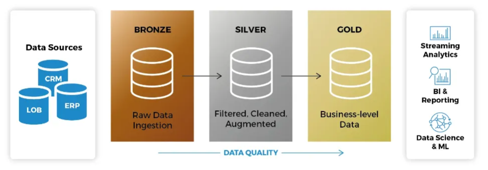

# Projeto de ETL com Azure, Databricks e Arquitetura Medallion

## 📌 Descrição do Projeto

Este projeto implementa um pipeline de **ETL (Extract, Transform, Load)** utilizando a **Arquitetura Medallion** no **Azure Databricks**, integrando diferentes serviços do Azure para ingestão, processamento e armazenamento de dados estruturados e não estruturados.


Fonte: https://blog.bismart.com/hs-fs/hubfs/Arquitectura_Medallion_Pasos.jpg?width=1754&height=656&name=Arquitectura_Medallion_Pasos.jpg

##  Arquitetura Medallion

A **Arquitetura Medallion** organiza os dados em três camadas, garantindo qualidade e estruturação progressiva:

###  Camada Bronze (Raw Data)

- Armazena os dados brutos exatamente como foram recebidos.
- Mantém o histórico e possibilita reprocessamentos.
- Dados provenientes de diferentes fontes são carregados no **Azure Data Lake Storage (Container)**.
- Montagem da camada Bronze via **Databricks**:

###  Camada Silver (Cleansed Data)

- Processamento e limpeza dos dados utilizando **Azure Databricks** (Apache Spark).
- Remoção de valores inconsistentes, duplicados e transformação dos tipos de dados.
- Os dados são armazenados em **Azure SQL Database** e **Azure Data Lake Storage**.

###  Camada Gold (Refined Data)

- Contém dados agregados e enriquecidos para análise e visualização.
- Prontos para consumo por **Power BI**, relatórios e modelos preditivos.

##  Tecnologias e Serviços Utilizados

###  **Azure Resources**

- **Azure Resource Group**: Agrupamento dos recursos para melhor gerenciamento.
- **Azure Storage Account**: Armazena dados brutos na camada Bronze.
- **Azure Databricks**: Plataforma para processamento distribuído e transformação de dados.
- **Azure SQL Database**: Armazena dados transformados na camada Silver.
- **Azure Container Instances**: Para orquestração de execução de jobs de ETL.
- **Azure Key Vault**: Gerenciamento seguro de credenciais.

###  **Ferramentas e Linguagens**

- **Python (Pandas, PySpark)**
- **SQL (Azure SQL, SQL Database)**
- **Apache Spark (Databricks Notebooks)**

##  Fluxo de Processamento ETL

1. **Extração (Extract)**: Coleta de dados de diversas fontes e armazenamento na camada Bronze (Azure Data Lake Storage).
2. **Transformação (Transform)**: Processamento com Databricks para limpeza, tratamento e enriquecimento dos dados.
3. **Carga (Load)**: Armazenamento dos dados refinados na camada Gold para análise e consumo.
4. **Envio para o Azure SQL Database**:

##Como Executar o Projeto

1. **Criar os Recursos no Azure:**
- Criar um **Resource Group** e uma **Storage Account**.
- Configurar um **Azure SQL Database**.
- Provisionar um **Databricks Workspace**.
     
2. **Configurar o Databricks:**
- Criar Clusters e Notebooks.
- Conectar ao **Azure Data Lake Storage**.
- Instalar bibliotecas necessárias (PySpark, Pandas, Delta Lake).
     
3. **Rodar os Scripts ETL:**
- Executar notebooks para ingestão de dados (Bronze → Silver → Gold).


## Organização do projeto

```

├── .gitignore         <- Arquivos e diretórios a serem ignorados pelo Git
├── ambiente.yml       <- O arquivo de requisitos para reproduzir o ambiente de análise
├── LICENSE            <- Licença de código aberto (MIT)
├── README.md          <- README principal para desenvolvedores que usam este projeto.
|
├── dados              <- Arquivos de dados para o projeto.
|
|
├── notebooks          <- Jupyter Notebooks com tratamento e análise dos dados.
│
|   └──src             <- Código-fonte para uso neste projeto.
|      │
|      ├── __init__.py  <- Torna um módulo Python
|      └──config.py    <- Configurações básicas do projeto
|    
|
├── referencias        <- Dicionários de dados
|
├── relatorios         <- Análises geradas em HTML, PDF, LaTeX, etc.
│   └── imagens        <- Imagens usadas no projeto
```

## Configuração do ambiente

1. Faça o clone do repositório.

    ```bash
    git@github.com:DanFalcari/ETL_Pipeline_Azure_Databricks.git
    ```
